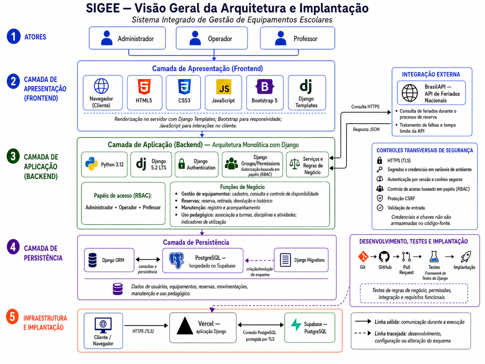

# Arquitetura do sistema

Este documento registra a arquitetura para o SIGEE. O diagrama representa a solução prevista para a entrega final

## Diagrama final da arquitetura

## Visão geral

O SIGEE adota uma arquitetura web monolítica com Django e renderização no servidor. Os usuários acessam a mesma aplicação pelo navegador, enquanto o backend centraliza a autenticação, a autorização, as regras de negócio, o acesso aos dados e a geração das páginas HTML.

A solução é organizada em camadas para separar responsabilidades sem introduzir um frontend independente ou uma API própria desacoplada.

| Camada | Tecnologias e responsabilidades |
|---|---|
| Apresentação | Navegador, Django Templates, HTML5, CSS3, Bootstrap 5 e JavaScript pontual para a interface e a responsividade. |
| Aplicação | Python 3.12 e Django 5.2 LTS para roteamento, autenticação, autorização, validações e regras de negócio. |
| Persistência | Django ORM para consultar e gravar dados no PostgreSQL, com Django Migrations para controlar a evolução do esquema. |
| Integração externa | BrasilAPI para consultar feriados nacionais durante o processo de reserva. |
| Infraestrutura | Aplicação Django prevista na Vercel e PostgreSQL hospedado no Supabase. |

## Atores e controle de acesso

O SIGEE possui três perfis funcionais: **Administrador**, **Operador** e **Professor**. A autenticação identifica o usuário, enquanto a autorização determina as operações permitidas para seu perfil.

O controle de acesso previsto utiliza os recursos nativos `Django Authentication`, `Groups` e `Permissions`, seguindo o modelo de controle de acesso baseado em papéis, ou RBAC. As permissões devem ser verificadas no servidor, independentemente das opções apresentadas na interface.

## Camada de apresentação

As páginas são renderizadas no servidor por meio de Django Templates. O Django processa a requisição, consulta os dados necessários e devolve o HTML ao navegador. Bootstrap 5 e CSS complementam a apresentação e a responsividade, enquanto JavaScript é empregado somente em interações pontuais no cliente.

Essa decisão mantém a interface integrada ao monólito Django e evita a complexidade de um frontend SPA separado para o escopo do projeto.

## Camada de aplicação

O backend concentra os serviços e as regras relacionadas às principais áreas funcionais:

- gestão de equipamentos, incluindo cadastro, consulta e disponibilidade;
- reservas, retiradas, devoluções e histórico de movimentações;
- registro e acompanhamento de manutenções;
- associação da utilização a turmas, disciplinas e atividades pedagógicas;
- consolidação de indicadores do inventário e da utilização pedagógica.

As validações de domínio devem permanecer no servidor para que as regras sejam aplicadas mesmo quando uma requisição não se originar da navegação comum da interface.

## Camada de persistência

O Django ORM faz a comunicação entre os modelos da aplicação e o banco de dados. O ambiente publicado utilizará PostgreSQL hospedado no Supabase; o Supabase será usado como infraestrutura do banco, sem substituir a autenticação e a autorização do Django.

As migrations registram a criação e a evolução do esquema. Elas fazem parte do processo de desenvolvimento e implantação, e não da comunicação permanente da aplicação durante seu uso. Na ausência de `DATABASE_URL`, a configuração atual permite SQLite somente para o desenvolvimento local.

## Integração com a BrasilAPI

Durante a criação de uma reserva, o backend deverá consultar a API de Feriados Nacionais da BrasilAPI por HTTPS. A resposta em JSON terá caráter informativo. Falhas, indisponibilidade ou tempo limite da integração não deverão impedir a conclusão da reserva.

A consulta será feita pelo backend, evitando que regras e detalhes da integração dependam diretamente do navegador.

## Segurança transversal

Os controles de segurança afetam todas as camadas da solução e incluem:

- comunicação por HTTPS e TLS no ambiente publicado;
- segredos e credenciais armazenados em variáveis de ambiente;
- autenticação por sessão e uso seguro de cookies;
- autorização baseada em grupos e permissões;
- proteção CSRF nos fluxos autenticados;
- validação das entradas no servidor;
- registro básico de acessos e ações relevantes para auditoria.

Credenciais, chaves e dados sensíveis não devem ser armazenados no código-fonte nem enviados aos templates ou ao JavaScript do cliente.

## Fluxo principal de uma requisição

De forma resumida, uma operação segue o fluxo:

1. O usuário acessa o SIGEE pelo navegador por uma conexão HTTPS.
2. O Django recebe a requisição e verifica a autenticação e as permissões aplicáveis.
3. O backend valida os dados e executa as regras de negócio.
4. O Django ORM consulta ou atualiza o banco de dados.
5. Quando necessário em uma reserva, o backend consulta a BrasilAPI.
6. O Django renderiza o template e devolve a resposta HTML ao navegador.

O fluxo principal pode ser representado por **Usuário → Navegador → Django → Regras de negócio → Django ORM → PostgreSQL**, com a integração complementar **Django ↔ BrasilAPI**.

## Desenvolvimento, testes e implantação

O código é versionado com Git e armazenado no GitHub. As alterações são integradas por Pull Requests e verificadas com o framework de testes do Django. O fluxo previsto é **Git → GitHub → Pull Request → Testes → Implantação**.

A implantação da aplicação na Vercel permanece condicionada à validação da compatibilidade com Django, conexão segura com o PostgreSQL e execução das migrations. O ambiente publicado deverá se comunicar com o PostgreSQL do Supabase por uma conexão protegida por TLS.

## Decisões técnicas principais

| Decisão | Motivo | Trade-off |
|---|---|---|
| Monólito Django com templates | Mantém a solução simples, integrada e compatível com o escopo acadêmico. | Não há frontend separado nem API própria desacoplada. |
| Recursos nativos do Django para autenticação e autorização | Evitam duplicação de mecanismos de identidade e facilitam a aplicação de permissões no servidor. | A configuração de grupos e permissões precisa ser mantida pela própria aplicação. |
| Supabase somente para hospedar o PostgreSQL | Fornece infraestrutura gerenciada para o banco sem alterar o modelo de autenticação definido. | Recursos como Supabase Auth e políticas RLS não fazem parte da solução. |
| BrasilAPI como integração não bloqueante | Acrescenta informação sobre feriados sem comprometer o fluxo principal de reserva. | A aplicação precisa tratar falhas e tempo limite e continuar funcionando sem a resposta externa. |
| Vercel como implantação prevista | Mantém a infraestrutura enxuta para o escopo do SIGEE. | A compatibilidade operacional com Django e migrations precisa ser comprovada antes da adoção definitiva. |
