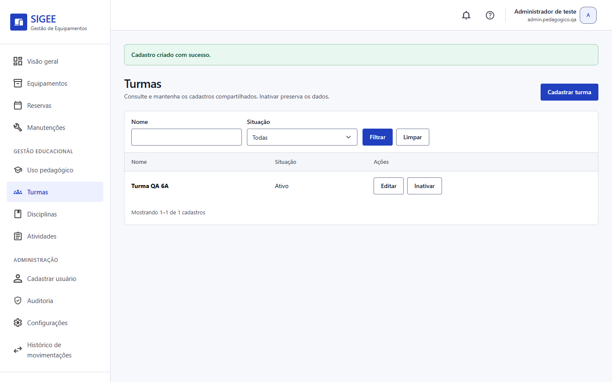
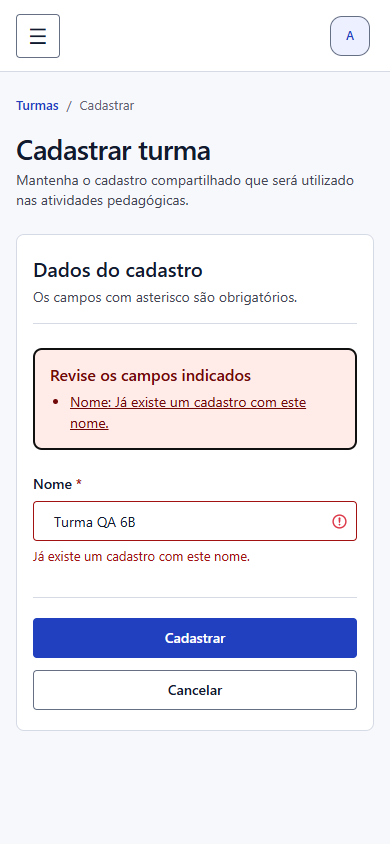
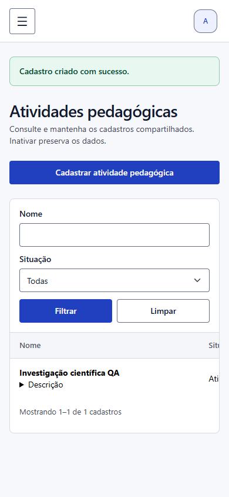

# Cadastros pedagógicos — entrega de 09/10

**Estado em 06/10/2026: implementado e validado localmente; aguardando revisão do Diego.**

Entrega desenvolvida diretamente na `main`, a partir de `4071580`, sem nova branch ou PR, conforme decisão da dupla. Implementação: [commit 9480ecb](https://github.com/PietroNozella/SIGEE/commit/9480ecb92e455425ac144e90ad968f08f00af35f).

## Modelo e escopo

O app `pedagogico` mantém três cadastros compartilhados independentes, conforme as entidades do DER atual. Esta entrega é a base cadastral para o RF-10 e não incluiu associação às utilizações nem indicadores do RF-11. O incremento posterior com reserva está descrito ao final; nenhum desses requisitos é declarado integralmente concluído.

| Entidade | Campos persistidos |
|---|---|
| `Turma` | `id`, `nome` obrigatório e único (100 caracteres), `ativo`, `data_criacao` |
| `Disciplina` | `id`, `nome` obrigatório e único (100 caracteres), `ativo`, `data_criacao` |
| `AtividadePedagogica` | `id`, `nome` obrigatório e único (150 caracteres), `descricao` opcional, `ativo`, `data_criacao` |

Registros começam ativos e a criação recebe data automática. Não há campos de alunos, ano letivo nem relacionamentos com Professor, Reserva ou Movimentação. Os formulários removem espaços nas extremidades do nome; a unicidade usa `unique=True`, com comparação exata, seguindo o padrão existente. Nomes iguais em cadastros diferentes são permitidos; registros inativos continuam participando da unicidade. Não se acrescentou equivalência entre maiúsculas e minúsculas.

## Fluxos, permissões e auditoria

As bases de URL são `/pedagogico/turmas/`, `/pedagogico/disciplinas/` e `/pedagogico/atividades/`. Cada base oferece listagem, `novo/`, `<id>/editar/`, `<id>/inativar/` e `<id>/reativar/`.

- Listagem ordenada por nome, busca parcial, filtro Todas/Ativos/Inativos e paginação de dez registros. Situação inicial: Todas.
- Criação e edição por formulários Django, com validação no servidor e dados preservados após erro.
- Inativação e reativação por `POST` com CSRF. As rotas fixam o estado desejado; repetições preservam o estado sem novo evento de mudança.
- Sem exclusão definitiva, rota de exclusão ou registro desses modelos no Django Admin.
- Conta ativa exclusivamente no grupo Administrador, com `view`, `add` ou `change` do modelo conforme a ação. Professor, Operador, Superuser técnico, conta sem permissão e grupos incompatíveis são bloqueados, inclusive por acesso direto.

`configurar_perfis` atribui nove permissões pedagógicas ao Administrador, sem `delete`. O menu usa a mesma verificação de consulta das views.

Criação, edição e mudança real de situação geram auditoria com ação, resultado, responsável, entidade e identificador, sem copiar nomes ou descrições. Criação rejeitada não tem identificador persistido; falhas de edição e situação referenciam o registro existente. Sucesso e alteração são gravados na mesma transação; falha de integridade desfaz a alteração e registra falha. Acesso negado segue o middleware existente.

## Evidências de validação

Com `DATABASE_URL` vazio e `DJANGO_DEBUG=True`:

```powershell
.venv/Scripts/python.exe manage.py test pedagogico --verbosity 1
.venv/Scripts/python.exe manage.py test --verbosity 1
.venv/Scripts/python.exe manage.py check
.venv/Scripts/python.exe manage.py makemigrations --check --dry-run
.venv/Scripts/python.exe manage.py migrate --check
```

O módulo contém **19 testes**, com cenários aplicados aos três cadastros. A suíte integrada executou **310 testes em 33,276 segundos: 304 aprovados e seis ignorados**. Inclui regressão de inventário, reservas e movimentações. `check` não apontou problemas (o aviso preexistente `axes.W006` permanece intencionalmente silenciado); não houve alterações de models sem migration nem migrations locais pendentes. `git diff --check` passou.

| Critério | Evidência em `pedagogico/tests.py` |
|---|---|
| Nome vazio, limite, espaços e unicidade no formulário/modelo/banco | `CadastroModelFormTests` |
| Criar, editar, inativar, reativar e preservar dados | `test_fluxo_criacao_edicao_inativacao_reativacao_com_auditoria` |
| Erros sem persistência parcial e formulário preservado | `test_dados_invalidos_nao_persistem_preservam_form_e_auditam_falha`, `test_edicao_invalida_preserva_dados_e_situacao` |
| GET sem mutação, CSRF e estado explícito idempotente | `test_get_nao_grava_e_situacao_exige_post`, `test_post_exige_csrf`, `test_situacao_e_idempotente_e_nao_pode_ser_adulterada` |
| Busca, filtro, paginação, permissão por ação e menu | `test_busca_filtro_paginacao_e_listagem_de_inativos`, `test_permissao_por_acao_e_navegacao` |
| Perfis, grupos, Superuser, inatividade e anonimato | `test_professor_operador_superuser_e_grupos_invalidos_nao_acessam`, `test_anonimo_e_conta_inativa_nao_acessam` |
| Rollback e conflito de unicidade após validação | `test_falha_na_auditoria_desfaz_gravacao_e_registra_falha`, `test_conflito_surgido_apos_validacao_nao_grava_e_exibe_erro` |
| Edição preserva mudança concorrente de situação | `test_edicao_nao_sobrescreve_situacao_alterada_apos_abrir_formulario` |
| Descrição escapada, registro inexistente e ausência de exclusão | `test_descricao_escapada_na_interface`, `test_registro_inexistente_e_exclusao_sem_rota` |

A conferência pelo navegador usou banco temporário separado e conta sintética. Foram observados criação dos três cadastros, edição/inativação/reativação de Turma, rejeição de duplicidade com espaços e campo preservado, expansão da descrição e menu móvel. A criação de Turma foi concluída por teclado com Tab e Enter. O erro recebeu foco no resumo. Em 390 × 844, formulário e listagem apresentaram largura de página de 390 pixels; a tabela tem rolagem horizontal própria para acessar todas as colunas. A apresentação desktop foi conferida em 1440 × 900.







## Banco e revisão

Antes de `pedagogico.0001_initial`, foi feito backup SQLite com verificação de integridade em `.tmp/backups/db-before-pedagogico-20261006-133844.sqlite3`. A migration e `configurar_perfis` foram aplicados ao SQLite local. Backup, bancos temporários, sessões de navegador e DOCX não versionado não integram os commits.

Para preparar outro ambiente, realizar o backup apropriado e executar `migrate`, seguido de `configurar_perfis`.

Após autorização explícita, em 06/10/2026 foram aplicadas ao PostgreSQL publicado as migrations pendentes `movimentacoes.0003`, `movimentacoes.0004` e `pedagogico.0001_initial`. A pré-verificação não encontrou devoluções sem origem nem origens com devoluções duplicadas. Antes das alterações, foi salva e conferida uma cópia lógica dos dados de 23 tabelas Django, com definições de colunas e constraints, em `.tmp/backups/postgres-before-pedagogico-20261006-135250.json.gz`. Essa cópia local não é um `pg_dump`, não foi versionada e sua restauração não foi ensaiada.

`configurar_perfis` foi executado no PostgreSQL; a conferência final encontrou zero migrations pendentes e nove permissões pedagógicas no Administrador. Isso comprova a preparação do banco e dos perfis; os fluxos do site publicado e os testes de concorrência ainda precisam de validação própria.

Na validação cadastral ficaram pendentes o retorno do Diego, os seis cenários existentes de concorrência em PostgreSQL e a validação no ambiente publicado. Os cenários de concorrência passaram posteriormente no PostgreSQL isolado do incremento com reserva, conforme as evidências abaixo; revisão e validação publicada continuam pendentes. Os testes simulados de conflito deste módulo, isoladamente, não comprovam concorrência real.

A associação de utilizações com reserva foi implementada e validada na branch `utilizacao-equipamentos`, conforme as [evidências do incremento de 13/10](utilizacao-pedagogica-reserva.md), ainda aguardando revisão e merge. A próxima etapa funcional é a associação sem reserva; os indicadores do RF-11 continuam pendentes.
