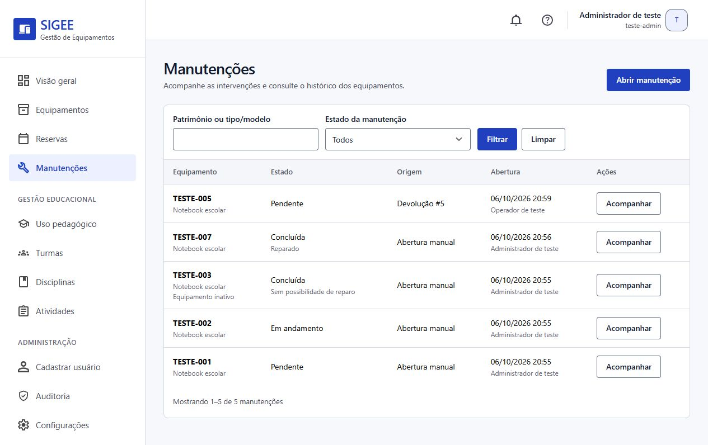
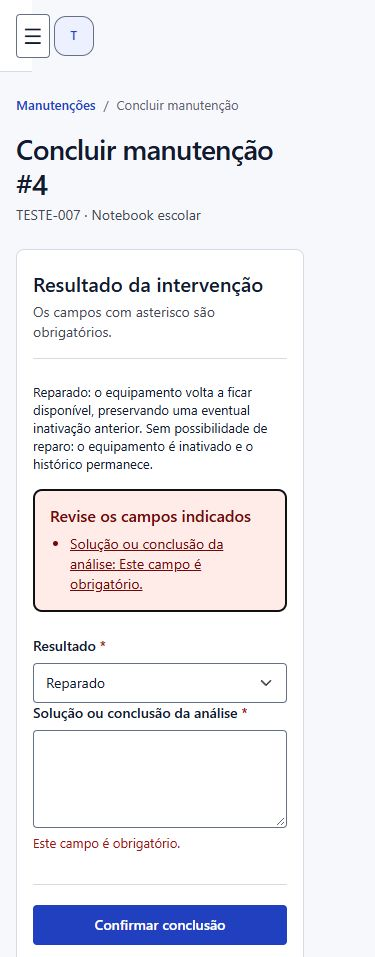
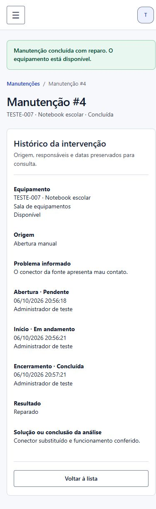
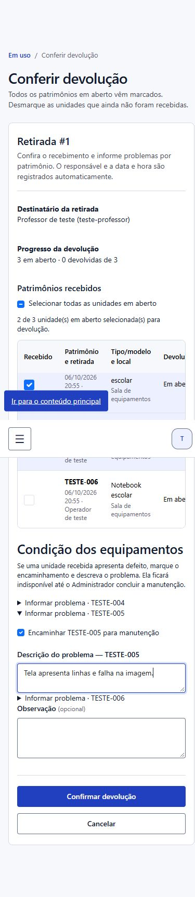

# Manutenção e devolução com problema

Implementação local de RF-07, RN-05 e RN-14 na branch `feat/manutencao`, baseada na `main` em `2623995`. A entrega não foi enviada ao GitHub nem aplicada ao ambiente publicado. A revisão cruzada e a validação de concorrência em PostgreSQL continuam pendentes.

## Comportamento

O Administrador abre uma manutenção para um equipamento ativo e disponível, descrevendo o defeito. O Operador pode iniciar o mesmo ciclo durante uma devolução: seleciona os patrimônios recebidos, marca individualmente os que apresentam problema e informa a descrição de cada ocorrência. Uma unidade desmarcada para recebimento não pode ser encaminhada para manutenção nessa confirmação.

O lote pode conter unidades normais, unidades com problema e unidades ainda pendentes. Cada devolução conserva equipamento, destinatário, retirada, reserva e identificador de lote originais. A manutenção automática referencia exclusivamente a devolução do equipamento afetado; a abertura manual não possui esse vínculo.

| Transição | Responsável | Efeito |
|---|---|---|
| Abertura → `PENDENTE` | Administrador na abertura manual; Operador durante a devolução | Equipamento assume `MANUTENCAO` e fica indisponível para retirada e reserva. |
| `PENDENTE` → `EM_ANDAMENTO` | Administrador | Preserva a indisponibilidade; registra início e responsável. |
| `EM_ANDAMENTO` → `CONCLUIDA`, resultado `REPARADO` | Administrador | Exige descrição da solução; retorna a `DISPONIVEL`. |
| `EM_ANDAMENTO` → `CONCLUIDA`, resultado `SEM_REPARO` | Administrador | Exige conclusão da análise; inativa o equipamento e mantém o histórico. |

Não há retorno de estado, edição livre nem exclusão de intervenções pelas rotas ou pelo Django Admin. Uma nova manutenção pode ser aberta depois do reparo quando o equipamento continua ativo e disponível. Uma inativação independente é preservada: nem receber um item com problema nem concluir seu reparo o reativa.

## Modelo e integridade

`manutencoes.Manutencao` contém equipamento, descrição, estado e responsável/data de cada etapa. `devolucao_origem` é uma relação opcional um para um com `Movimentacao`. Equipamento, devolução e responsáveis usam `PROTECT`, impedindo remoção dos registros referenciados. A exclusão funcional de um equipamento com manutenção passa a inativá-lo, como já ocorre para movimentações e reservas.

A migration `manutencoes.0001_initial` cria a tabela e as restrições:

- no máximo uma manutenção `PENDENTE` ou `EM_ANDAMENTO` por equipamento;
- uma única intervenção por devolução de origem;
- descrição do problema não vazia;
- estados, datas e responsáveis coerentes entre as etapas;
- conclusão com resultado reconhecido e solução não vazia;
- início posterior ou igual à abertura e conclusão posterior ou igual ao início.

O model normaliza os textos e valida que a origem seja uma devolução do mesmo equipamento. As consultas de unicidade e os serviços não substituem as restrições do banco. A conferência de tipo/equipamento da origem e a rejeição de textos contendo somente espaços são validações do model; não são constraints entre tabelas ou normalização automática de SQL direto.

## Transações e integração

Na devolução, as retiradas e os equipamentos selecionados já são bloqueados em ordem estável. A abertura da manutenção reutiliza essa transação: todas as devoluções, manutenções, situações e eventos de sucesso do lote são confirmados juntas. Falha em qualquer etapa reverte o lote inteiro, incluindo as unidades normais já processadas. O recebimento básico continua funcionando sem encaminhamento.

A abertura manual e as transições bloqueiam primeiro o equipamento; início e conclusão bloqueiam depois a intervenção. Estado e autorização são reconsultados antes da gravação. A edição e a exclusão funcional do inventário também bloqueiam o equipamento antes de validar e gravar, evitando que um formulário anterior à manutenção sobrescreva sua situação. O `clean()` de Equipamento impede liberar uma manutenção aberta pela edição comum.

Auditoria: `MANUTENCAO_ABERTA`, `MANUTENCAO_INICIADA` e `MANUTENCAO_CONCLUIDA`, com usuário, entidade e resultado. Eventos de sucesso participam da transação. As views podem registrar falhas separadamente; não copiam a descrição livre para a auditoria. A exportação assistida de dados da conta inclui os vínculos e as responsabilidades estruturadas na manutenção, sem listar identidades de outros responsáveis.

O histórico de movimentações exibe a manutenção originada na devolução. O Administrador pode abrir seu detalhe; o Operador consulta a referência e o estado pelo histórico, sem receber permissão de gestão do módulo.

## Rotas e autorização

| Rota | Método | Permissão do Administrador funcional |
|---|---|---|
| `/manutencoes/` | GET | `view_manutencao` |
| `/manutencoes/nova/` | GET/POST | `add_manutencao` |
| `/manutencoes/<id>/` | GET | `view_manutencao` |
| `/manutencoes/<id>/iniciar/` | POST | `change_manutencao` |
| `/manutencoes/<id>/concluir/` | GET/POST | `change_manutencao` |

Todas exigem conta ativa, exclusivamente no grupo Administrador e sem Superuser técnico. Permissão individual não substitui o perfil. Operador usa somente o fluxo autorizado de devolução, com `movimentacoes.add_movimentacao`. Gravações por POST exigem CSRF.

O Administrador consulta todas as intervenções, inclusive concluídas e de equipamentos inativos, com busca por patrimônio/tipo, filtro de estado e paginação de 15 registros. A navegação e os formulários reutilizam o layout existente. A devolução funciona também sem JavaScript; o diálogo de confirmação destaca as unidades encaminhadas.

## Preparação local e verificação

Antes de aplicar a migration no SQLite local, foi feita uma cópia com a API de backup do SQLite e conferida sua integridade. A migration não altera situações antigas nem inventa intervenções para equipamentos anteriormente marcados como `MANUTENCAO`. Esses registros permanecem com sua situação original.

A preparação encontrou `pedagogico.0001_initial`, já versionada na `main`, pendente neste SQLite. Ela também foi aplicada para permitir executar `configurar_perfis`. Ao final, havia zero migrations pendentes, três permissões de manutenção no Administrador, 42 equipamentos preservados e nenhuma manutenção criada no banco de trabalho. Os cenários sintéticos usaram exclusivamente o banco temporário separado.

```powershell
$env:DATABASE_URL=''
python manage.py migrate
python manage.py configurar_perfis
python manage.py check
python manage.py makemigrations --check --dry-run
python manage.py test
```

Estes comandos usam SQLite local. A implantação futura exige conferir o ambiente antes de aplicar a migration e os perfis ao PostgreSQL.

Verificação final em 06/10/2026: **345 testes, 336 aprovados e nove ignorados no SQLite**, em 64,389 segundos. O módulo `manutencoes` contém 35 testes (32 aprovados e três de concorrência ignorados). Os outros seis ignorados pertencem às movimentações. `manage.py check` aprovado, com o aviso preexistente `axes.W006` silenciado; `makemigrations --check --dry-run` sem alterações e `git diff --check` aprovado. Nenhum desses resultados comprova concorrência em PostgreSQL.

Os testes em `manutencoes/tests.py` exercitam ambos os resultados do encerramento, outro Administrador, transições inválidas, descrição obrigatória, restrições do banco, perfis/grupos/permissões, CSRF, POST adulterado, histórico, filtros, rollback, lotes mistos/parciais, reserva, destinatário inativo, origem inválida, inativação independente, bloqueio de edição e exportação da conta. Três testes adicionais usam conexões independentes para duas aberturas, dois inícios e duas conclusões concorrentes; dependem de `select_for_update` e são ignorados no SQLite.

Conferência visual local com banco separado e contas sintéticas: abertura manual, início, conclusão com reparo usando teclado, solução obrigatória com foco no resumo de erros, devolução parcial de três unidades (uma normal, uma com problema e uma ainda em uso), acompanhamento da origem e conclusão sem reparo. Desktop no viewport padrão do navegador; celular em 390 × 844, sem transbordamento horizontal da página. As tabelas têm rolagem própria. Isso não constitui uma auditoria completa de acessibilidade.









## Limites da entrega

Concorrência real em PostgreSQL, aplicação ao ambiente publicado e revisão por outro integrante não foram validadas nesta entrega local. RF-07/RN-14 possuem implementação e evidências locais; a conclusão formal do card ainda depende desses critérios. Painel (RF-08), associação pedagógica (RF-10) e indicadores (RF-11) continuam fora deste incremento.
