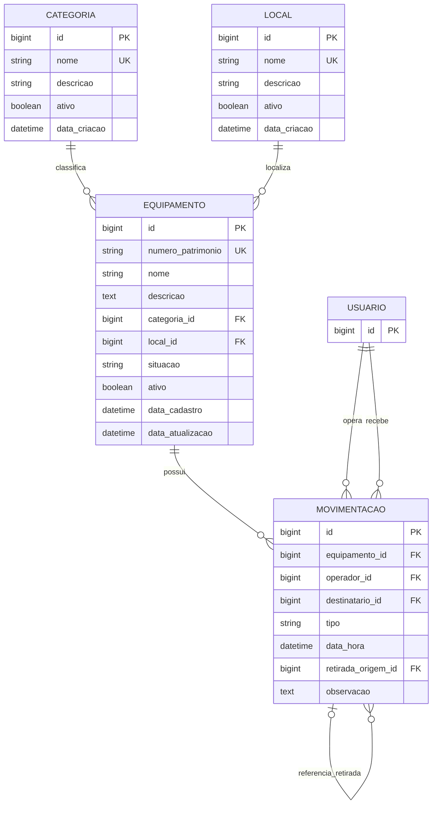

# Diagrama Entidade-Relacionamento

O diagrama abaixo representa exclusivamente os modelos implementados no estado atual do SIGEE. O usuário corresponde ao modelo de autenticação configurado pelo Django.

Reservas, manutenções, turmas, disciplinas, atividades pedagógicas e indicadores ainda não aparecem no DER porque não possuem modelos implementados.
