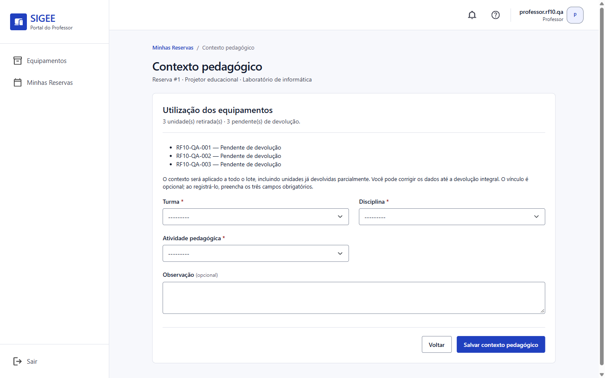
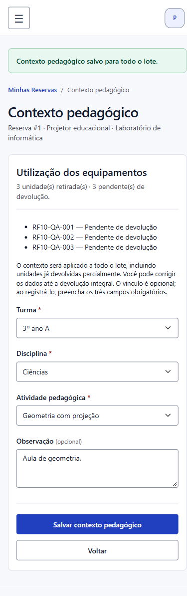
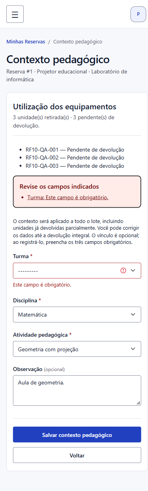
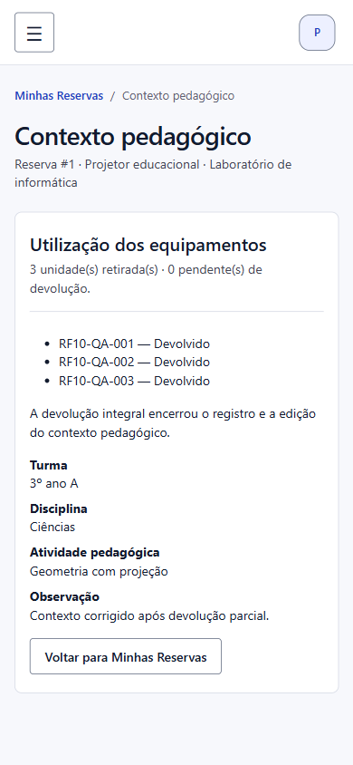

# Utilização pedagógica com reserva — incremento de 13/10

**Estado em 06/10/2026:** implementado e validado na branch `utilizacao-equipamentos`; aguardando revisão do Diego e integração à `main`. Aplicação ainda não publicada; migration e permissões já aplicadas ao PostgreSQL publicado, após autorização.

## Recorte e decisões aprovadas

Este incremento atende ao fluxo com reserva do RF-10 e à RN-15. A retirada sem reserva da RN-16 e os indicadores do RF-11 permanecem pendentes. O RF-10 não é declarado integralmente concluído.

O Professor preenche o contexto somente depois da retirada de uma reserva própria. O vínculo é opcional; ao registrá-lo, Turma, Disciplina e Atividade Pedagógica são obrigatórias, com Observação opcional. Um formulário aplica o mesmo contexto a todas as unidades retiradas. É possível criar ou corrigir enquanto existir pelo menos uma unidade pendente; a devolução integral encerra ambas as operações, mesmo se o formulário tiver sido aberto antes.

Na devolução parcial, a correção também atualiza o contexto das unidades já devolvidas daquele lote. Não há exclusão do vínculo nem preenchimento automático de utilizações anteriores.

## Modelo, interface e integridade

`UtilizacaoPedagogica` segue a entidade do DER: `movimentacao` único, `professor`, `turma`, `disciplina`, `atividade`, `observacao` e `data_criacao`. Os relacionamentos usam `PROTECT`. Cada registro representa a utilização de uma unidade física; o formulário único evita que o Professor repita o preenchimento por patrimônio. Agregações futuras devem explicitar se contam unidades ou lotes.

Professor e movimentações vêm do servidor. O Professor precisa ser proprietário da reserva e destinatário de todas as retiradas. A devolução mantém seu vínculo à retirada original, de onde consulta o contexto, sem copiá-lo. Inativação dos equipamentos e cadastros não apaga referências. Os nomes exibidos acompanham o cadastro atual; não há snapshot nem versionamento de textos.

`GET/POST /pedagogico/reservas/<reserva_id>/utilizacao/` oferece consulta e formulário pela lista Minhas Reservas. Exige conta ativa exclusivamente no grupo Professor, sem Superuser, e permissões `view`, `add` ou `change` conforme a operação. Reserva alheia ou inexistente retorna 404. Administrador e Operador consultam o contexto no histórico já autorizado, sem edição; o Professor não recebe acesso ao histórico geral nem aos cadastros administrativos.

Novas escolhas são restritas a cadastros ativos. Uma referência já vinculada pode ser mantida após sua inativação. Sem opção obrigatória, a página informa a necessidade de cadastro/reativação pelo Administrador e desabilita o botão de gravação.

O serviço bloqueia todas as retiradas em ordem de ID, sem joins anuláveis no `SELECT FOR UPDATE`, compatível com a devolução. Reconsulta devoluções e bloqueia os cadastros escolhidos antes de gravar. Todo o lote e as auditorias de sucesso ficam na mesma transação; falha de validação ou integridade desfaz o lote e registra a falha fora da transação. Os eventos `UTILIZACAO_PEDAGOGICA_CRIADA` e `UTILIZACAO_PEDAGOGICA_EDITADA` identificam a associação, sem copiar textos. Reenvio sem mudança não cria duplicatas nem eventos adicionais. Edições concorrentes são serializadas; prevalece a última gravação válida.

A exportação de dados do titular inclui `utilizacoes_pedagogicas`, com referências, nomes, observação e data de criação. A anonimização existente preserva a conta de referência e os registros históricos.

## Validação automatizada

Com `DATABASE_URL` vazio e `DJANGO_DEBUG=True`, a suíte completa executou **331 testes em 35,229 segundos: 323 aprovados e oito ignorados**, todos os ignorados dependentes de bloqueios reais de banco. O incremento acrescenta **21 testes** em `pedagogico/test_utilizacao.py`.

```powershell
$env:DATABASE_URL=''
$env:DJANGO_DEBUG='True'
.venv/Scripts/python.exe manage.py test --verbosity 1
.venv/Scripts/python.exe manage.py check
.venv/Scripts/python.exe manage.py makemigrations --check --dry-run
.venv/Scripts/python.exe manage.py migrate --check
git diff --check
```

`check` passou, mantendo somente o silenciamento preexistente de `axes.W006`. Não há mudanças de models sem migration nem migrations locais pendentes; `git diff --check` passou.

Em **PostgreSQL 17.6**, num contêiner efêmero isolado com porta exposta somente em `127.0.0.1`, foram executados **199 testes de pedagogia, movimentações e reservas em 31,991 segundos, todos aprovados, sem ignorados**. O banco de testes foi criado e removido pelo Django. Nenhum banco publicado foi acessado. Os dois novos testes de concorrência verificam gravação simultânea à devolução integral e duas gravações simultâneas para o mesmo lote; também passaram os seis cenários preexistentes de movimentações.

| Comportamento | Evidência em `pedagogico/test_utilizacao.py` |
|---|---|
| Lote, edição, devolução parcial/integral e consulta | `test_fluxo_completo_lote_edicao_devolucao_parcial_integral_e_consulta` |
| Ausência de retirada e primeiro registro após devolução | `test_sem_retirada_nao_ha_formulario_nem_gravacao`, `test_primeiro_registro_depois_de_devolver_tudo_e_bloqueado` |
| Propriedade, perfis, permissões por ação, anonimato e CSRF | testes de propriedade, perfis, permissão por ação e conta inativa |
| Campos obrigatórios, adulteração, cadastros inativos e revalidação | testes de campos, IDs e referência inativa |
| Reenvio idempotente e rollback com falha na segunda auditoria | testes de reenvio e falha de auditoria |
| Histórico com escape, exportação, anonimização e inativação | testes de histórico, exportação e `PROTECT` |
| Concorrência com devolução e entre gravações | `ConcorrenciaUtilizacaoTests` |

## Conferência da interface

Foi usado um SQLite temporário separado em `.tmp/utilizacao-ui.sqlite3`, com três contas sintéticas e uma reserva de três projetores. O cenário inicial e a retirada foram preparados por serviços; os novos fluxos de vínculo e edição e as devoluções foram conferidos na interface.

Foram observados o acesso por Minhas Reservas, criação dos três vínculos com um formulário, salvamento com Tab e Enter, correção de disciplina no celular, rejeição de Turma vazia com outros campos preservados e foco em `form-errors`, devolução parcial de uma unidade pelo Operador, edição do contexto com duas pendências, devolução das demais e consulta sem campos de edição. O histórico do Operador preservou o contexto nas três retiradas e três devoluções.

Desktop: 1440 × 900. Celular: 390 × 844, com rolagem vertical e sem estouro horizontal; a largura da página foi 390 pixels no formulário válido e 375 no erro com barra de rolagem. O console apresentou a falta preexistente de `/favicon.ico`; não houve erro JavaScript do novo fluxo.






## Banco local e revisão

Antes de aplicar `pedagogico.0002_utilizacaopedagogica`, foi feito backup SQLite por API de backup, com `PRAGMA integrity_check` aprovado, em `.tmp/backups/db-before-utilizacao-20261006-145644.sqlite3`. Migration e `configurar_perfis` foram aplicados somente ao SQLite local; foram conferidas zero migrations pendentes e três permissões de utilização pedagógica no Professor. Backup, banco sintético e scripts temporários não integram a entrega versionada.

Após autorização explícita em 06/10/2026, a mesma migration foi aplicada ao PostgreSQL publicado. A pré-verificação encontrou somente `pedagogico.0002_utilizacaopedagogica` pendente. Antes da alteração, foi salva e conferida uma cópia lógica dos dados de 26 tabelas Django, com definições de colunas e constraints, em `.tmp/backups/postgres-before-utilizacao-20261006-150727.json.gz`. Essa cópia não é um `pg_dump` e sua restauração não foi ensaiada. A migration e `configurar_perfis` concluíram com sucesso; foram conferidos zero migrations pendentes, a existência da nova tabela, três permissões de utilização pedagógica no Professor, nenhuma permissão de exclusão desse modelo no grupo e nove permissões cadastrais pedagógicas no Administrador. A preparação do banco não publica o código da branch nem comprova os fluxos no site.

Para a revisão do Diego: conferir o fluxo completo, a restrição a reservas próprias, a correção de todas as unidades após devolução parcial e o bloqueio após devolução integral, usando os cenários acima. Permanecem pendentes o retorno dele, merge, publicação e validação do site publicado. A execução local em PostgreSQL não comprova o ambiente publicado. O próximo incremento funcional é a utilização pedagógica sem reserva.
